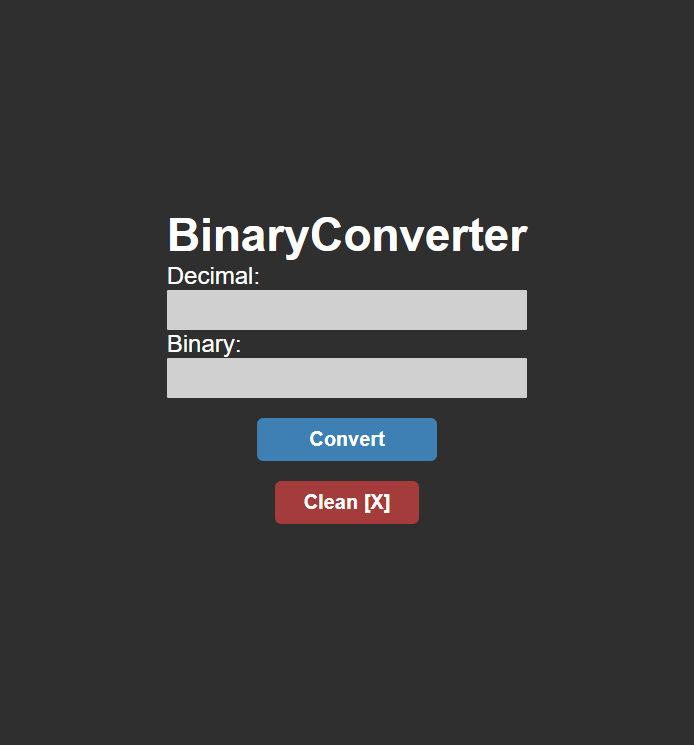

# BinaryConverter 

## Projeto Conversor de Decimal pra Binario e vice-versa👈 

## Click para ver: <a href='https://joaogabrielz.github.io/BinaryConverter'>Deploy</a> 

### Tecnologias usadas: 👈 
 HTML , 
 CSS , 
 JAVASCRIPT , 
 VSCODE

 C , 
 Dev-C++ 
- Projeto Responsivo
- Autoral
